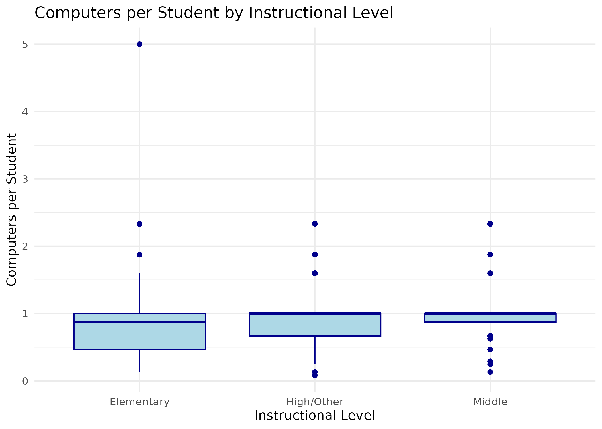
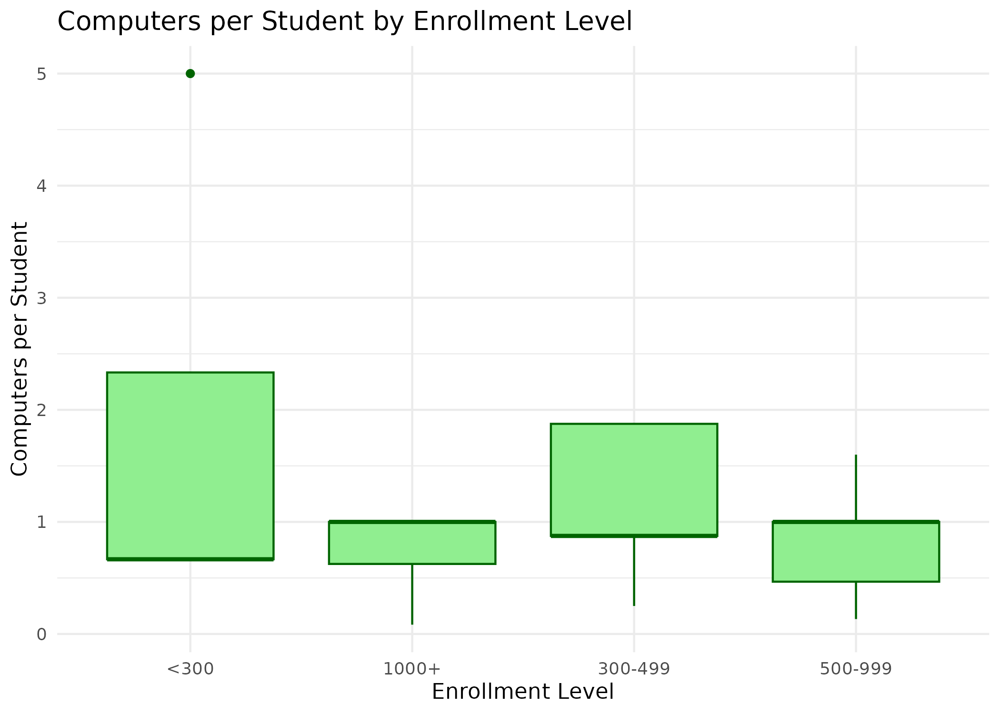

# Student-Use Computers in U.S. Public Schools (2019–20)

 
 
 
 


## Table of Contents

- [Project Overview](#project-overview)
- [Research Question](#research-question)
- [Data Source](#data-source)
- [Installation & Dependencies](#installation--dependencies)
- [Data Extraction Script](#data-extraction-script)
- [Converting SAS Data to CSV](#converting-sas-data-to-csv)
- [Data Cleaning Updates](#data-cleaning-updates)
- [Visualizations](#visualizations)
- [Project Preview](#project-preview)
- [Assumptions & Notes](#assumptions--notes)
- [License](#license)

## Project Overview

This project explores student-use computer access in U.S. public schools during the 2019–20 school year, using publicly available data from the NCES FRSS 110 dataset. The primary goal is to calculate a clear, interpretable metric: the number of computers per student, and to visualize how it varies by school characteristics.

This project demonstrates:

- Data extraction and cleaning in R
- Calculation of derived metrics
- Visualization of educational technology access
- Reproducible workflow and documentation

## Research Question

*“How does the number of computers per student vary across different instructional and enrollment levels?”*

## Data Source

**NCES FRSS 110** – Public School Use of Educational Technology (2019–20)  
[NCES FRSS 110 Dataset](https://nces.ed.gov/surveys/frss/publications/2019111/index.asp)

## Installation & Dependencies

**R version:** ≥ 4.0.0  
**Required R packages:**  
```r
install.packages(c("tidyverse", "readr", "ggplot2", "dplyr"))
```

Clone this repository:

```bash
git clone https://github.com/yourusername/student-computers-us-public-schools.git
cd student-computers-us-public-schools
```

## Data Extraction Script

### Script
```bash
Rscript cleaning_scripts/extraction_script.R
```

### Purpose

* Extracts the contents of NCES FRSS 110 ZIP files for analysis
* Prepares raw data, documentation, and SAS scripts for further processing

### Prerequisites

* Place the ZIP files in `data/raw/` before running:

  * `2022011_FRSS_PUF_DAT.zip`
  * `2022011_FRSS_PUF_DOC.zip`
  * `2022011_FRSS_PUF_FULL.zip`

### Usage

```bash
Rscript cleaning_scripts/extraction_script.R \
  data/raw/2022011_FRSS_PUF_DAT.zip \
  data/raw/2022011_FRSS_PUF_DOC.zip \
  data/raw/2022011_FRSS_PUF_FULL.zip
```

## Converting SAS Data to CSV

```bash
Rscript cleaning_scripts/convert_sas_to_csv.R
```

## Data Cleaning Updates

* `LEVEL3` → `INSTRUCTIONAL_LEVEL` (1 = Elementary, 2 = Middle, 3 = High/Other)
* `SIZCL2` → `ENROLLMENT_LEVEL` (1 = <300, 2 = 300–499, 3 = 500–999, 4 = 1,000+)
* `P_Q4TOT` → `COMPUTERS_PER_STUDENT` (calculated as total computers divided by total enrollment)
* Converted categorical codes to descriptive string labels for clarity
* Removed extraneous or imputed columns

## Visualizations

Two visualizations were created:

1. **Computers per student by instructional level**

   * `INSTRUCTIONAL_LEVEL` on the x-axis, `COMPUTERS_PER_STUDENT` on the y-axis
   * Script: `Rscript visualization_scripts/plot_computers_by_instructional_level.R`

2. **Computers per student by enrollment level**

   * `ENROLLMENT_LEVEL` on the x-axis, `COMPUTERS_PER_STUDENT` on the y-axis
   * Script: `Rscript visualization_scripts/plot_computers_by_enrollment_level.R`

## Project Preview

Here are examples of the visualizations you can generate:

**Computers per Student by Instructional Level**  


**Computers per Student by Enrollment Level**  


## Assumptions & Notes

* The dataset does not differentiate types of computers; all student-use computers are included
* Approximate numbers are used for computers and enrollment due to public-use file confidentiality restrictions

These updates improve clarity and usability of the dataset and visualizations for analyzing educational technology access in schools.

## License

This project is licensed under the MIT License. See the [LICENSE](LICENSE) file for details.

